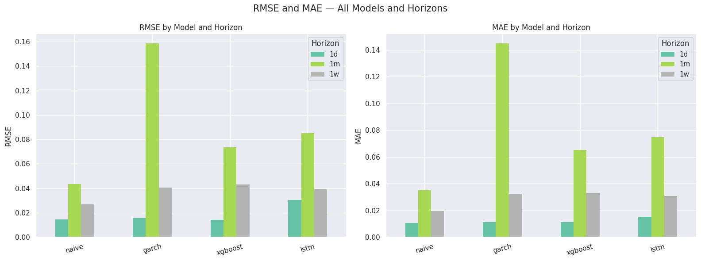
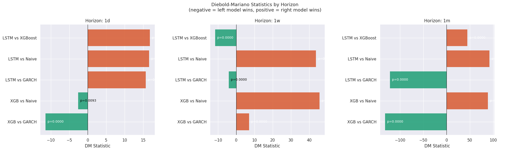
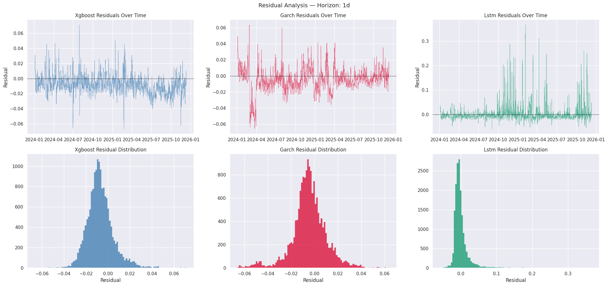

# Bitcoin Volatility Forecasting

Can machine learning beat the standard finance model at predicting how volatile Bitcoin will be?

This project forecasts Bitcoin's realized volatility 1 day, 1 week, and 1 month ahead. Two machine learning models, XGBoost and an LSTM neural network, are tested against GARCH(1,1), the standard econometric model for volatility, and against a naive persistence baseline.

> Final project for CSCI 424 (Big Data Mining). Earned the maximum score.

**Stack:** Python, pandas, NumPy, scikit-learn, XGBoost, TensorFlow/Keras, arch, SciPy, matplotlib, seaborn

## Results

The test set covers January 2024 through December 2025: 17,064 hourly observations the models never saw during training or tuning. Lower is better.

| Model | MAE 1d | MAE 1w | MAE 1m | RMSE 1d | RMSE 1w | RMSE 1m |
|---|---|---|---|---|---|---|
| Naive (persistence) | **0.0107** | **0.0195** | **0.0351** | 0.0145 | **0.0270** | **0.0434** |
| GARCH(1,1) | 0.0115 | 0.0325 | 0.1448 | 0.0158 | 0.0405 | 0.1584 |
| XGBoost | 0.0114 | 0.0333 | 0.0652 | **0.0142** | 0.0432 | 0.0734 |
| LSTM | 0.0152 | 0.0310 | 0.0747 | 0.0306 | 0.0392 | 0.0851 |

At every horizon, at least one ML model beat GARCH:

- **1 day (XGBoost).** Lower MAE and RMSE than GARCH, a significant Diebold-Mariano result (DM = −11.5, p < 0.001), and Mincer-Zarnowitz coefficients closer to ideal. XGBoost was also the only model to beat the naive baseline anywhere, with the best 1-day RMSE and a significant DM edge over naive (p = 0.009).
- **1 week (LSTM).** Lower MAE and RMSE than GARCH, confirmed by Diebold-Mariano (DM = −4.1, p < 0.001).
- **1 month (XGBoost and LSTM).** Both roughly halved GARCH's error (DM = −132 and −121).

The naive baseline was the harder benchmark. Apart from XGBoost's 1-day RMSE, it posted the lowest error everywhere. Bitcoin volatility clusters: high-volatility stretches tend to stay high and calm stretches stay calm, so "same as last period" is hard to beat on average. Where persistence fails is at regime changes, and those are the moments a risk model exists for. The Mincer-Zarnowitz regressions point to the next improvement. Every model under-predicts and under-reacts (alpha above 0, beta well below 1).

<p align="center">
  
</p>

<p align="center">
  
</p>

<p align="center">
  
</p>

The [`results/`](results/) folder has the full metric tables as CSVs, forecast-vs-actual plots and residuals for every horizon, Mincer-Zarnowitz charts, XGBoost feature importance, and LSTM training curves. Everything comes from the run saved in [`notebooks/csci_424_final.ipynb`](notebooks/csci_424_final.ipynb).

## Methodology

```
raw hourly OHLCV ──► clean ──► log returns ──► forward realized-vol targets
                                   │
                                   ▼
                      57 leakage-safe features
                                   │
                chronological split: train 2018–22 | val 2023 | test 2024–25
                                   │
        ┌──────────────┬───────────┴──────┬─────────────────┐
      Naive     GARCH(1,1), Student-t    XGBoost          LSTM
                refit every 30 days     early-stopped   72-hour sequences
        └──────────────┴───────────┬──────┴─────────────────┘
                                   ▼
          RMSE / MAE · Mincer-Zarnowitz · Diebold-Mariano · figures
```

- **Target.** Realized volatility over the next 24, 168, or 720 hours: the square root of summed squared hourly log returns ([`targets.py`](btcvol/targets.py)).
- **Features** ([`features.py`](btcvol/features.py)). Return lags, past realized volatility, rolling mean/std/skew/kurtosis, volume and trade-count activity, taker buy/sell pressure, high-low range, and cyclical hour/day encodings. Each feature is shifted so it only uses data available before the current bar.
- **No lookahead.** Splits are strictly chronological. XGBoost and the LSTM use the validation set only for early stopping, and the LSTM's scaler is fit on training data alone. GARCH is refit every 30 days using only data up to that point in the test period.
- **Evaluation** ([`evaluation.py`](btcvol/evaluation.py)). One scoring function for every model. Mincer-Zarnowitz regressions measure bias and responsiveness, and Diebold-Mariano tests check whether accuracy differences are statistically significant.

## Project layout

```
run_pipeline.py          entry point; runs the full pipeline
btcvol/
  config.py              dates, horizons, feature windows, hyperparameters
  data.py                ingestion, cleaning, log returns
  targets.py             forward realized-volatility targets
  features.py            feature engineering and dataset freeze
  splits.py              chronological and walk-forward splits
  models/
    naive.py             persistence baseline
    garch.py             GARCH(1,1) with periodic refits
    xgb.py               XGBoost, one model per horizon
    lstm.py              two-layer LSTM
  evaluation.py          RMSE/MAE, Mincer-Zarnowitz, Diebold-Mariano
  plots.py               EDA, residual, and comparison figures
notebooks/
  csci_424_final.ipynb   submitted notebook, with outputs
results/                 metric tables and figures from that run
```

## Running it

**Google Colab (recommended).** [Open the notebook in Colab](https://colab.research.google.com/github/Utuub/bitcoin-volatility-forecasting/blob/main/notebooks/csci_424_final.ipynb), select **Runtime → Change runtime type → T4 GPU**, upload the CSV, and run all cells. This is how the submitted results were produced.

**Locally:**

```bash
pip install -r requirements.txt
python run_pipeline.py --data path/to/btc_1h_data_2018_to_2025.csv            # full run (requires TensorFlow)
python run_pipeline.py --data path/to/btc_1h_data_2018_to_2025.csv --no-lstm  # skip the LSTM
```

Predictions, trained models, metric tables, and figures are written to `outputs/`. GARCH is the slowest step, since it produces a forecast for every test hour.

**Data.** Hourly BTC candles from Kaggle, 2018 through early 2026 (about 71,000 rows). The pipeline expects the columns `Open, High, Low, Close, Volume, Quote asset volume, Number of trades, Taker buy base asset volume, Taker buy quote asset volume`, with rows treated as consecutive hours starting 2018-01-01. The CSV isn't included in the repo.

The raw Kaggle file contains one corrupt row: a duplicate `2018-07-07 00:00` bar priced near $107,000 while Bitcoin traded around $6,600. It was removed before the submitted run. Leaving it in distorts GARCH and every rolling feature. Expect small differences from the published numbers across library versions.

## Limitations and next steps

- **Structural breaks.** The data spans the FTX collapse and the 2020 and 2024 halvings, so a model trained mostly on earlier years won't fully carry over to newer market behavior.
- **Market data only.** No macro variables (rates, equity correlation) or sentiment signals.
- **One configuration for three horizons.** Tuning for one horizon hurt the others. Separate per-horizon models are the most obvious next step.
- **Point forecasts only.** Any real trading or risk application would need confidence intervals.

This is a forecasting study and isn't intended as trading advice.

## Acknowledgments

The idea of testing XGBoost and LSTM against GARCH comes from Kumar, Rao & Dhochak, [*Hybrid ML models for volatility prediction in financial risk management*](https://www.sciencedirect.com/science/article/pii/S1059056025000784).
